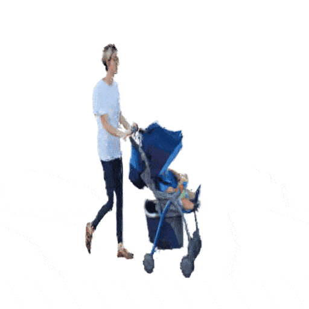

# DreamScene4D: Dynamic Multi-Object Scene Generation from Monocular Videos


> [**DreamScene4D: Dynamic Multi-Object Scene Generation from Monocular Videos**](https://dreamscene4d.github.io/)            
> Carnegie Mellon University   
> Wen-Hsuan Chu*, Lei Ke*, Katerina Fragkiadaki    

### [**[Project Page]**](https://dreamscene4d.github.io/) **|** [**[Paper]**](https://arxiv.org/abs/2405.02280)

<table>
  <tr>
    <td style="text-align: center; vertical-align: middle;"></td>
    <td style="text-align: center; vertical-align: middle;"></td>
  </tr>
</table>

News and Todos
-----------------
- (07.07.2024) v1 of the code has been released!
- (TODO) Release scripts for obtaining evaluation data splits on DAVIS and for reproducing results.

Installation
-----------------
We recommend using conda to create separate Python environments.
```bash
# Create new conda env
conda create -n dreamscene4d python=3.8.18
conda activate dreamscene4d

# Install PyTorch
# Any version between 2.0 to 2.3 should work, no guarantees for higher versions
conda install pytorch==2.2.0 torchvision==0.17.0 torchaudio==2.2.0 pytorch-cuda=11.8 -c pytorch -c nvidia

# Install customized diffusers
pip install ./diffusers

# Install other dependencies
pip install -r requirements.txt

# simple-knn and nvdiffrast
pip install ./simple-knn
pip install git+https://github.com/NVlabs/nvdiffrast/

# GMFlow and Gaussian Splatting

# IMPORTANT: Download weights manually to gmflow/pretrained/gmflow_kitti-285701a8.pth from https://drive.google.com/file/d/1d5C5cgHIxWGsFR1vYs5XrQbbUiZl9TX2/view

# You can check the GMFlow readme for more detailed instructions
git submodule update --init --recursive
# Install modified gaussian splatting (+ depth, alpha rendering)
pip install ./diff-gaussian-rasterization
```

Demo Run
-----------------
We provide two ways to run our model: a fully automatic script that executes each stage sequentially and also the stage-by-stage scripts. The stage-by-stage scripts allows you to visualize the outputs of each stage to make sure nothing is broken before you run other scripts. We also included some parsed videos that can be used for some quick demos. If you want to run your own videos, please take a look at the Data Format section to see what is required.

For demo 1 and demo 2, we will demonstrate the usage of the fully automatic scripts.

### Demo 1
<table>
  <tr>
    <td style="text-align: center; vertical-align: middle;"></td>
    <td style="text-align: center; vertical-align: middle;"></td>
    <td style="text-align: center; vertical-align: middle;"></td>
  </tr>
</table>
This example contains a man playing with two dogs, where parts of the person undergo occlusions. We have provided the inpainted frames already. To run the fully automatic script on the inpainted video sequence, use:

```bash
# This version loads the per-object inpainted frames. Recommended for videos with occlusions.
# When using custom videos, you should first check if off-the-shelf inpainting methods give reasonable results.

python run_with_inpaint.py --lite --data_dir ./data/JPEGImages/dogs-jump --mask_dir ./data/Annotations/dogs-jump --inpainted_dir ./data/InpaintedImages/dogs-jump --inpainted_mask_dir ./data/InpaintedMasks/dogs-jump --save_name dogs-jump
```

* `--lite`: (Optional), runs the script with less optimization steps. Trade-off between speed and performance.
* `--data_dir`: Directory where the RGB frames are saved.
* `--mask_dir`: Directory where the maks annotations are saved.
* `--inpainted_dir`: Directory where the *inpainted* RGB frames are saved.
* `--inpainted mask_dir`: Directory where the *inpainted* maks annotations are saved.
* `--save_name`: Identifier name for the saved files.

You can also run ```python run_with_inpaint.py --help``` to see other optional arguments alongside with their descriptions.

### Demo 2
<table>
  <tr>
    <td style="text-align: center; vertical-align: middle;"></td>
    <td style="text-align: center; vertical-align: middle;"></td>
    <td style="text-align: center; vertical-align: middle;"></td>
  </tr>
</table>
This example contains two objects (a person pushing a stroller). To run fully automatic script on the original video sequence, simply run:

```bash
# This version loads the original un-inpainted frames. Recommended for videos without occlusions.
python run_no_inpaint.py --lite --data_dir ./data/JPEGImages/stroller --mask_dir ./data/Annotations/stroller --save_name stroller
```

* `--lite`: (Optional), runs the script with less optimization steps. Trade-off between speed and performance.
* `--data_dir`: Directory where the RGB frames are saved.
* `--mask_dir`: Directory where the maks annotations are saved.
* `--save_name`: Identifier name for the saved files.

Like in demo 1, you can run ```python run_no_inpaint.py --help``` to see other optional arguments alongside with their descriptions.

---

For demo 3 and demo 4, we will demonstrate the usage of the stage-by-stage optimization scripts. This is solely for explanation purposes, you can use the fully-provided scripts to achieve the same effect.

### Demo 3
<table>
  <tr>
    <td style="text-align: center; vertical-align: middle;"></td>
    <td style="text-align: center; vertical-align: middle;"></td>
    <td style="text-align: center; vertical-align: middle;"></td>
  </tr>
</table>
This example contains a person jumping on rollerblades. To run the stage-by-stage scripts on the video sequence, use:

```bash
# For custom videos, you need to run stage 1 and stage 2 for every object of interest in the video,
# while incrementing the save_path by 1 (e.g. XXX_1, XXX_2, ...).

# Stage 1: 3D Gaussian optimization
python main.py --config configs/image.yaml input=./data/JPEGImages/rollerblade/00000.png input_mask=./data/Annotations/rollerblade/001/00000.png outdir=./gaussians visdir=./vis save_path=lucia_1

# Stage 2: Deformation optimization, for fast results, try iters=(30 * Number of frames).
# On custom videos, you can try iters=(50 * Number of frames) or even iters=(100 * Number of frames)
# if the results from less optimation iterations don't look good.
python main_4d.py --config configs/4d.yaml iters=1000 input=./data/JPEGImages/rollerblade input_mask=./data/Annotations/rollerblade/001 outdir=./gaussians visdir=./vis save_path=lucia_1

# Stage 3: Scene composition
python main_4d_compose.py --config configs/4d.yaml input=./data/JPEGImages/rollerblade input_mask=[./data/Annotations/rollerblade/001/00000.png] outdir=./gaussians visdir=./vis save_path=lucia
```

### Demo 4
<table>
  <tr>
    <td style="text-align: center; vertical-align: middle;"></td>
    <td style="text-align: center; vertical-align: middle;"></td>
    <td style="text-align: center; vertical-align: middle;"></td>
  </tr>
</table>
This example contains two objects: a person kicking a ball. To run the stage-by-stage scripts on the video sequence, use:

```bash
# For custom videos, you need to run stage 1 and stage 2 for every object of interest in the video,
# while incrementing the save_path by 1 (e.g. XXX_1, XXX_2, ...).

# Stage 1: 3D Gaussian optimization
python main.py --config configs/image.yaml input=./data/JPEGImages/kid-football/00054.png input_mask=./data/Annotations/kid-football/001/00054.png outdir=./gaussians visdir=./vis save_path=kid-football_1
python main.py --config configs/image.yaml input=./data/JPEGImages/kid-football/00054.png input_mask=./data/Annotations/kid-football/002/00054.png outdir=./gaussians visdir=./vis save_path=kid-football_2

# Stage 2: Deformation optimization, for fast results, try iters=(30 * Number of frames).
# On custom videos, you can try iters=(50 * Number of frames) or even iters=(100 * Number of frames)
# if the results from less optimation iterations don't look good.
python main_4d.py --config configs/4d.yaml iters=300 input=./data/JPEGImages/kid-football input_mask=./data/Annotations/kid-football/001 outdir=./gaussians visdir=./vis save_path=kid-football_1
python main_4d.py --config configs/4d.yaml iters=300 input=./data/JPEGImages/kid-football input_mask=./data/Annotations/kid-football/002 outdir=./gaussians visdir=./vis save_path=kid-football_2

# Stage 3: Scene composition
python main_4d_compose.py --config configs/4d.yaml input=./data/JPEGImages/kid-football input_mask=[./data/Annotations/kid-football/001/00054.png,./data/Annotations/kid-football/002/00054.png] outdir=./gaussians visdir=./vis save_path=kid-football
```

---

For demo 5, we include a long video sequence with 78 frames, consisting of 5 objects. In theory, our method can handle arbitrarily long video sequences (we have tested videos with 120 frames) with an arbitrary amount of objects. However, you should expect a longer optimization time for more complex and longer videos.

### Demo 5
<table>
  <tr>
    <td style="text-align: center; vertical-align: middle;"></td>
    <td style="text-align: center; vertical-align: middle;"></td>
    <td style="text-align: center; vertical-align: middle;"></td>
  </tr>
</table>
This examples contains 5 goldfishes that are swimming. For simplicity, we will use the fully automatic script here to reduce the number of python commands one needs to execute. Simply run:

```bash
# Might be good to go grab a coffee while this runs :)
python run_no_inpaint.py --lite --data_dir ./data/JPEGImages/gold-fish --mask_dir ./data/Annotations/gold-fish --save_name gold-fish
```

Data Format
-----------------
If you have your own video frames and masks, we require the data format to be stored like this. Please also check the provided data samples under the *data* directory for some examples.
```
data
├── JPEGImages
│   └── video_name
│   	├── 00000.png
│   	├── 00001.png
│   	└── ...
├── Annotations
│   └── video_name
│   	├── 001
│       │   ├── 00000.png
│       │   ├── 00001.png
│       │   └── ...
│   	├── 002
│      	│   ├── 00000.png
│       │   ├── 00001.png
│       │   └── ...
│       └── ...
├── InpaintedImages
│   └── video_name
│   	├── 001
│       │   ├── 00000.png
│       │   ├── 00001.png
│       │   └── ...
│   	├── 002
│      	│   ├── 00000.png
│       │   ├── 00001.png
│       │   └── ...
│       └── ...
├── InpaintedMasks
│   └── video_name
│   	├── 001
│       │   ├── 00000.png
│       │   ├── 00001.png
│       │   └── ...
│   	├── 002
│      	│   ├── 00000.png
│       │   ├── 00001.png
│       │   └── ...
│       └── ...
```

We use *JPEGImages* and *Annotations* for running scripts without inpainting, and *InpaintedImages* and *InpaintedMasks* additionally for running scripts with inpainting. If you do not need to inpaint, you do not need to prepare the 2 inpainted directories.

Note: The names of the individual frame RGBs and masks do not necessarily need to start from 0 and increment by 1, but it needs to be sorted according to the timestamp and be a 5 digit number (padded with zeroes). You can also see this demonstrated in our provided files.

**Optional** Mask Tracker Installation 
-----------------
If you just have an unparsed video (e.g. mp4), you can follow the instructions under the *trackseg* directory to extract mask tracks and optionally inpaint the frames as following:

```bash

cd trackseg

pip install -e .

bash scripts/download_models.sh

# Then install the fork of **Grounded-Segment-Anything** (https://github.com/hkchengrex/Grounded-Segment-Anything) combined with **HQ-SAM** (https://github.com/SysCV/sam-hq). Follow its instructions.

git clone --recursive https://github.com/hkchengrex/Grounded-Segment-Anything.git

cd Grounded-Segment-Anything

export AM_I_DOCKER=False
export BUILD_WITH_CUDA=True
export CUDA_HOME=/path/to/cuda-11.8/

python -m pip install -e segment_anything

python -m pip install -e GroundingDINO

pip install onnxruntime onnx ipykernel

# Note: Grounding DINO installation might fail silently. Try python -c "from groundingdino.util.inference import Model as GroundingDINOModel". If you get a warning about running on CPU mode only, make sure you have CUDA_HOME set during Grounding DINO installation.

cd ../trackseg

sh visual.sh
```

Reproducing Paper Results
-----------------
If you wish to reproduce our results as closely as possible, please use the following scripts. For general use cases we recommend executing the commands in the previous Demo section.

```bash
Coming soon!
```

Tips
-----------------
- If you don't have enough VRAM, you can try decreasing the batch size in the config files. This may give sub-optimal results as the gradients will be more noisy.

- The number of training iterations is highly correlated to the quality of the results. If the results don't look good, you can try optimizing for more steps. If you're feeling bold, you can also use less steps for faster results.

- The coordinate system is defined as follows:
```
    World            Camera        
  
     +y              up  target                                              
     |               |  /                                            
     |               | /                                                
     |______+x       |/______right                                      
    /                /         
   /                /          
  /                /           
 +z               forward           

Elevation: in (-90, 90), +y is -90 and -y is 90
Azimuth: in (-180, 180), +z is 0 and +x is 90
```

Citation
---------------
If you find DreamScene4D useful in your research or refer to the provided baseline results, please star this repository and consider citing:
```
@article{dreamscene4d,
  title={DreamScene4D: Dynamic Multi-Object Scene Generation from Monocular Videos},
  author={Chu, Wen-Hsuan and Ke, Lei and Fragkiadaki, Katerina},
  journal={arXiv preprint arXiv:2405.02280},
  year={2024}
}
```

## Acknowledgments
- Thanks to [DEVA](https://github.com/hkchengrex/Tracking-Anything-with-DEVA), [DreamGaussian](https://dreamgaussian.github.io/), [HQ-SAM](https://github.com/SysCV/sam-hq/), [DreamGaussian4D](https://jiawei-ren.github.io/projects/dreamgaussian4d/), and [3D Gaussian Splatting](https://repo-sam.inria.fr/fungraph/3d-gaussian-splatting/) for their public code and released models.
